# NetKnife Architecture

Logical diagrams for system topology, user flows, billing, and data. For deployment steps see [README](../README.md) and [infra/envs/dev/README](../infra/envs/dev/README.md). For Stripe setup see [STRIPE-SETUP.md](./STRIPE-SETUP.md).

**Contents:** [System overview](#1-system-overview) · [Infrastructure modules](#2-infrastructure-modules) · [Authentication](#3-authentication) · [Tool execution](#4-tool-execution) · [Billing](#5-billing) · [Profile & reports](#6-profile--reports) · [Message board](#7-message-board) · [Data model](#8-data-model) · [CI & security](#9-ci--security) · [Related docs](#related-docs)

---

## 1. System overview

NetKnife is a **serverless** app: React SPA on S3/CloudFront, API on API Gateway HTTP API + Lambda, auth on Cognito, persistence on DynamoDB, payments on Stripe.

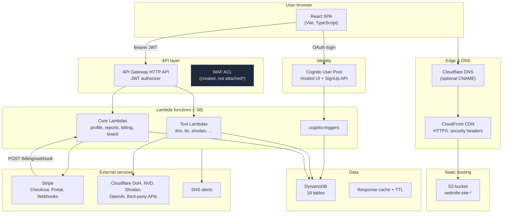

> \* **WAF note:** Terraform provisions `netknife-{env}-api-waf`, but AWS WAF v2 cannot attach to API Gateway **HTTP APIs**. Rate limiting today relies on Cognito JWT + optional upstream API quotas. See [IMPROVEMENTS.md](./IMPROVEMENTS.md).

---

## 2. Infrastructure modules

Terraform lives under `infra/modules/` and is wired from `infra/envs/dev/`.

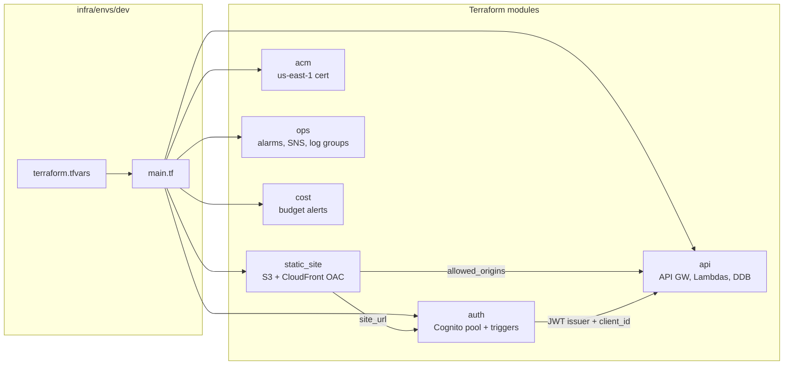

| Module | Key outputs | Purpose |
|--------|-------------|---------|
| `static_site` | `cloudfront_domain`, `bucket_name` | Private S3, CloudFront, SPA error routing |
| `acm` | ACM ARN | TLS for custom domain (must be `us-east-1` for CloudFront) |
| `auth` | `user_pool_id`, `client_id`, `cognito_domain_url` | User pool, Hosted UI, signup triggers |
| `api` | `api_url` | HTTP API, ~38 Lambdas, DynamoDB tables, shared layer |
| `ops` | `alerts_topic_arn` | CloudWatch alarms → SNS email |
| `cost` | — | Monthly AWS budget notification |

**Deploy path:** `terraform apply` → `frontend/update-env.sh` → `npm run build` → `aws s3 sync` → CloudFront invalidation.

---

## 3. Authentication

### 3.1 Login (Hosted UI)

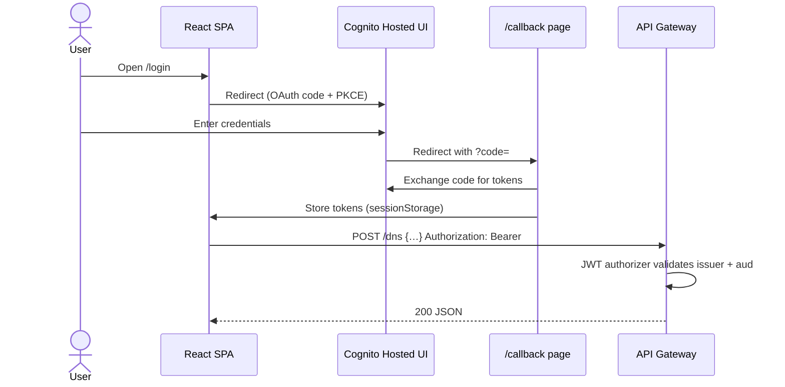

**Key files:** `frontend/src/lib/auth.ts`, `frontend/src/app/views/LoginPage.tsx`, `frontend/src/app/views/CallbackPage.tsx`, `infra/modules/auth/`.

### 3.2 Signup (custom form + triggers)

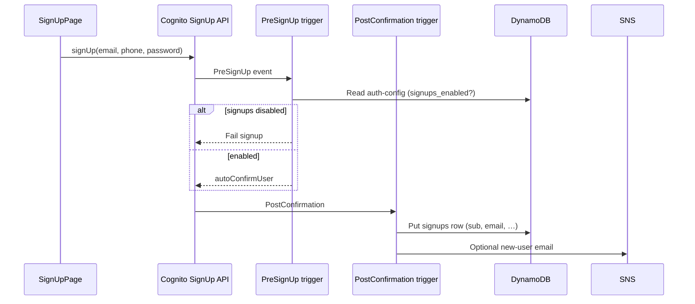

**Failsafe:** `netknife-{env}-auth-config` item `id=CONFIG` with `signups_enabled`. Admins can flip signups off without redeploying Lambdas.

### 3.3 Authorization layers

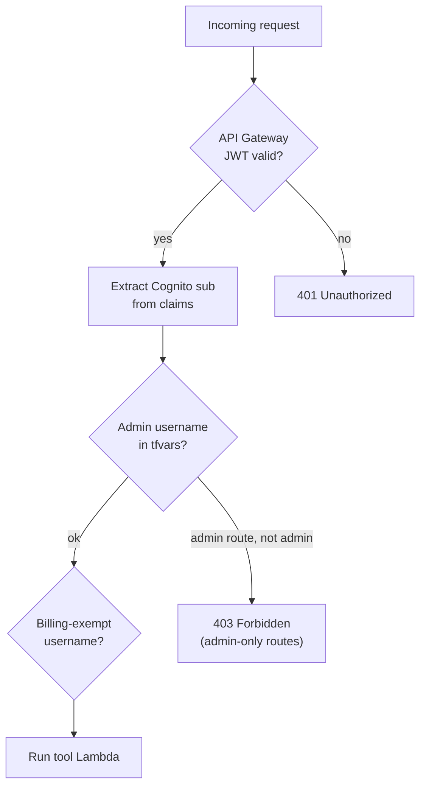

---

## 4. Tool execution

60 tools are registered in `frontend/src/tools/registry.tsx`: **30 offline** (browser-only) and **30 remote** (API-backed).

### 4.1 Offline vs remote

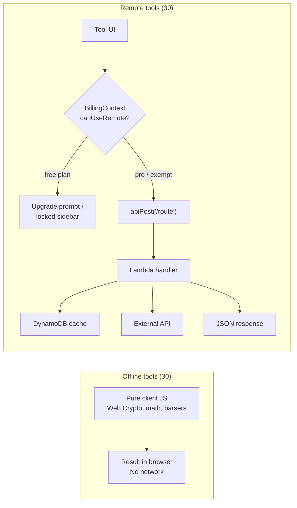

### 4.2 Remote tool request path

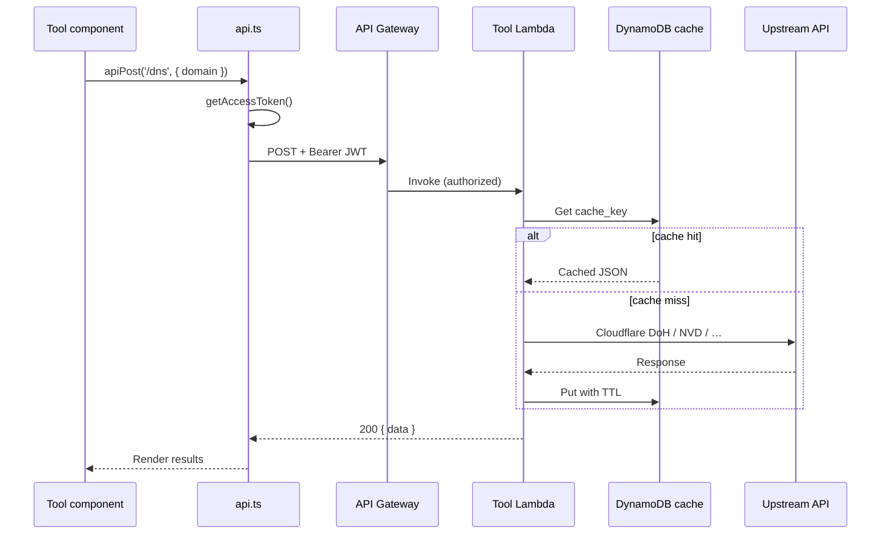

**Important gap:** Usage limits (`remoteCalls`, `advisorMessages`, `reportSaves`) are **enforced in the frontend** today. The billing Lambda reads usage from `netknife-{env}-usage`, but most tool Lambdas do **not** increment counters or return `402 Payment Required`. A client that calls the API directly can bypass Pro gating. See [IMPROVEMENTS.md](./IMPROVEMENTS.md#1-server-side-billing-enforcement-critical).

### 4.3 OSINT Dashboard orchestration

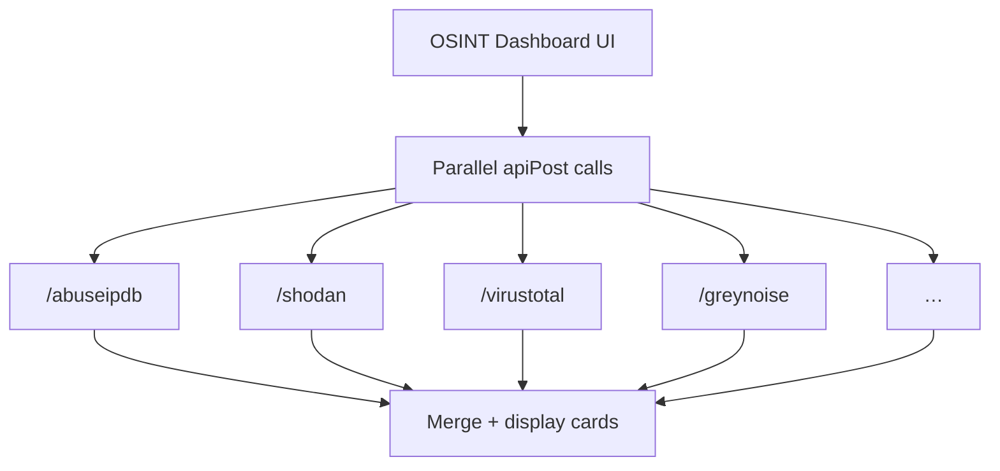

---

## 5. Billing

Plans are defined in `backend/functions/billing/index.js`:

| Plan | Remote calls | Advisor msgs | Report saves |
|------|-------------|--------------|--------------|
| `free` | 0 | 0 | 3 |
| `pro` ($5/mo) | 500 | 100 | 50 |
| `grandfathered` | unlimited | unlimited | unlimited |

`alex.lux` and `billing_exempt_usernames` in tfvars are always exempt.

### 5.1 Subscription checkout

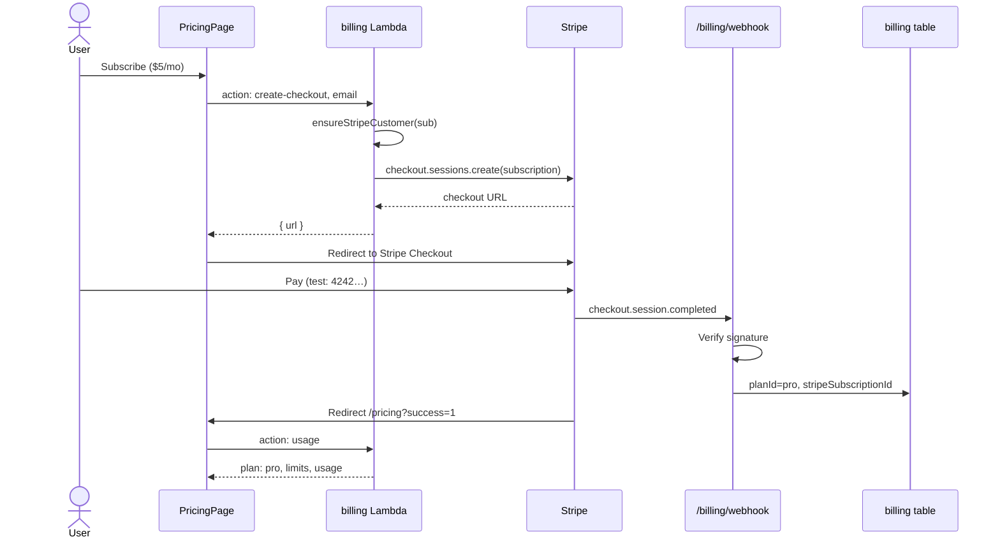

### 5.2 Donation (one-time, no plan change)

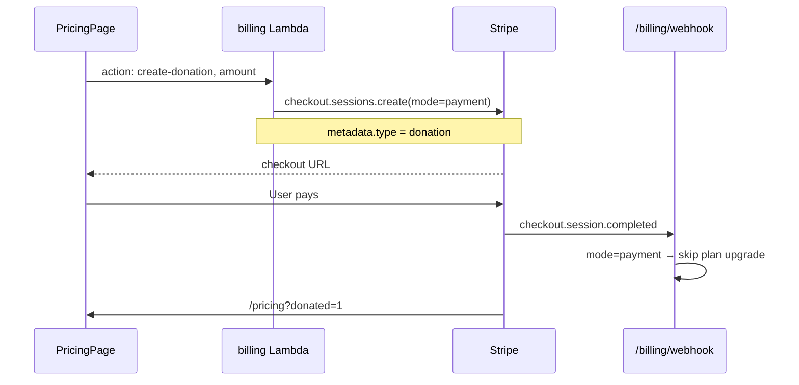

### 5.3 Billing state machine

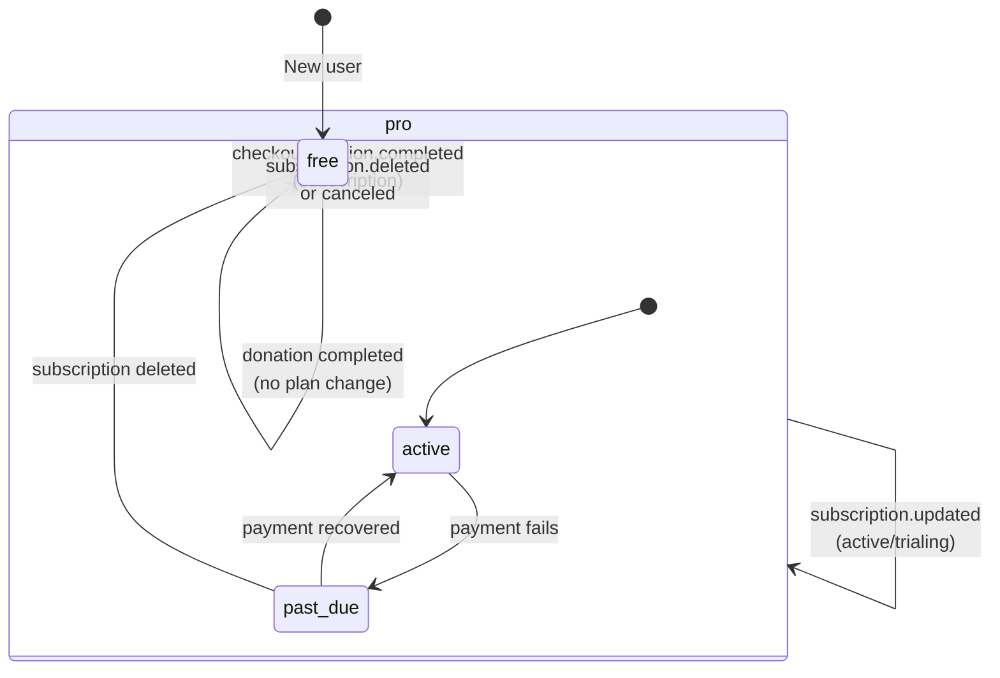

### 5.4 Stale Stripe customer recovery

After rotating Stripe API keys to a new account, DynamoDB may still reference old `cus_…` IDs. The billing Lambda detects `resource_missing` and clears stale refs:

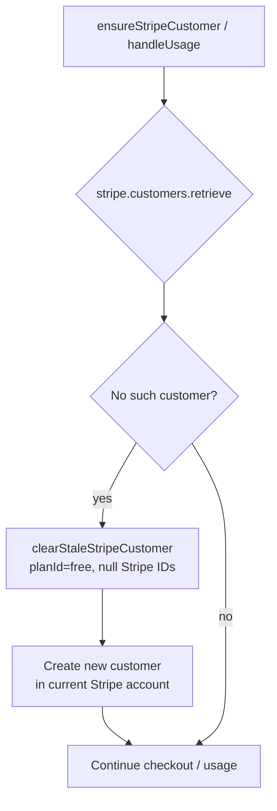

---

## 6. Profile & reports

### 6.1 Profile / avatar

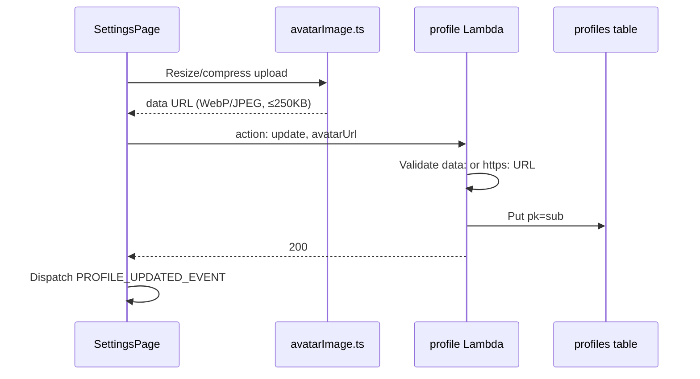

### 6.2 Report builder

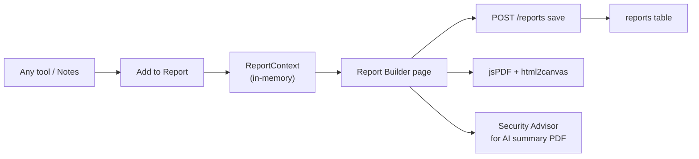

---

## 7. Message board

Eight DynamoDB tables back channels, threads, comments, likes, bookmarks, DMs, and an admin activity feed.

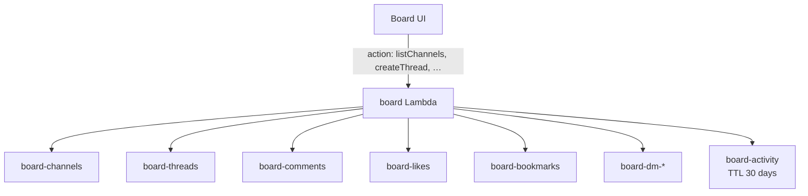

Admin-only actions (e.g. create channel) check `admin_usernames` from environment.

---

## 8. Data model

```mermaid
erDiagram
  COGNITO_USER ||--o| PROFILES : "pk = sub"
  COGNITO_USER ||--o| BILLING : "pk = sub"
  COGNITO_USER ||--o{ USAGE : "pk = sub, sk = MONTH#YYYY-MM"
  COGNITO_USER ||--o{ REPORTS : "pk = userId#type"
  COGNITO_USER ||--o| SIGNUPS : "pk = sub"
  COGNITO_USER ||--o{ GUIDE_PROGRESS : "USER#sub"

  BILLING {
    string pk
    string planId
    string stripeCustomerId
    string stripeSubscriptionId
    string periodEnd
  }

  USAGE {
    string pk
    string sk
    int remoteCalls
    int advisorMessages
    int reportSaves
  }

  PROFILES {
    string pk
    string displayName
    string avatarUrl
    string theme
    string bio
  }

  CACHE {
    string cache_key
    json value
    int expires_at
  }
```

**Table prefix:** `netknife-{env}-*` (e.g. `netknife-dev-billing`). Full list in `infra/modules/api/main.tf`.

---

## 9. CI & security

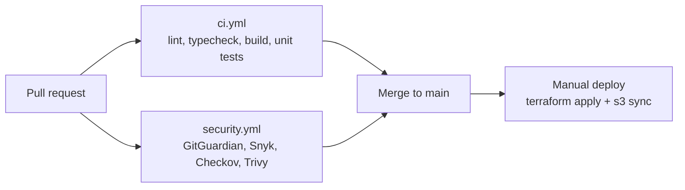

| Control | Where |
|---------|--------|
| JWT validation | API Gateway authorizer (production path) |
| CORS | `allowed_origins` = site URL only |
| SSRF | Private IPs blocked in `headers` Lambda |
| Secrets | tfvars gitignored; Lambda env vars |
| Stripe webhooks | Signature verification (`whsec_…`) |
| Alerts | CloudWatch → SNS on Lambda errors, API 5xx |

---

## Related docs

| Document | Topic |
|----------|--------|
| [IMPROVEMENTS.md](./IMPROVEMENTS.md) | Prioritized recommendations |
| [STRIPE-SETUP.md](./STRIPE-SETUP.md) | Stripe products, webhooks, test cards |
| [KNOWLEDGE-BASE.md](./KNOWLEDGE-BASE.md) | Security checklists & tool directory |
| [scripts/README.md](../scripts/README.md) | Python `nk` CLI for deploy/test/ops |
| [SECURITY.md](../SECURITY.md) | CI security scanning |
| [CICD.md](./CICD.md) | GitHub Actions deploy on push to main |
| [README § Roadmap](../README.md#improvements--roadmap) | Task-sized backlog (B/M/L) |
