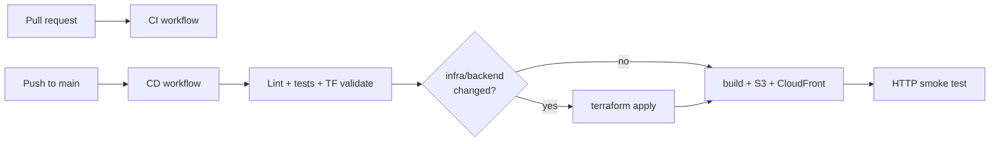

# CI/CD

NetKnife uses GitHub Actions for **CI on pull requests** and **CD on push to `main`**.

| Workflow | Trigger | Purpose |
|----------|---------|---------|
| [`.github/workflows/ci.yml`](../.github/workflows/ci.yml) | Pull request | Lint, typecheck, build, tests, `terraform fmt` + `validate` |
| [`.github/workflows/cd.yml`](../.github/workflows/cd.yml) | Push to `main` | Tests → deploy infra (if changed) → deploy frontend → smoke test |
| [`.github/workflows/security.yml`](../.github/workflows/security.yml) | Push + PR | Secrets scan, npm audit, Snyk, Checkov, Trivy |



---

## One-time setup (required for CD)

Until the deploy secrets/variables below are configured, the CD workflow still runs its test job but skips the deploy jobs instead of failing immediately.

### 1. Remote Terraform state

CI needs shared state. Run once locally:

```bash
bash infra/ci/bootstrap-state.sh
```

Add the printed values as **GitHub Actions secrets**:

| Secret | Example |
|--------|---------|
| `TF_STATE_BUCKET` | `netknife-tfstate-026600053230` |
| `TF_STATE_LOCK_TABLE` | `netknife-tfstate-lock` |

Migrate local state:

```bash
cp infra/envs/dev/backend.hcl.example infra/envs/dev/backend.hcl
cp infra/envs/dev/backend.tf.example infra/envs/dev/backend.tf
# Edit bucket/table in backend.hcl

cd infra/envs/dev
terraform init -backend-config=backend.hcl -migrate-state
```

Local dev **without** `backend.tf` / `backend.hcl` keeps using `terraform.tfstate` in this directory. CI writes `backend.tf` from `backend.tf.example` at deploy time.

### 2. Terraform variables secret

Copy your entire local `terraform.tfvars` into one secret (multiline supported):

**Settings → Secrets and variables → Actions → New repository secret**

| Secret | Value |
|--------|-------|
| `NETKNIFE_TFVARS` | Full contents of `infra/envs/dev/terraform.tfvars` |

Update this secret whenever you change tfvars locally.

### 3. AWS credentials for GitHub Actions

**Option A — OIDC (recommended)**

```bash
cd infra/ci/github-oidc
cp terraform.tfvars.example terraform.tfvars
# Set github_org and github_repo

terraform init && terraform apply
```

Add **repository variable** (not secret):

| Variable | Value |
|----------|-------|
| `AWS_ROLE_TO_ASSUME` | `terraform output -raw role_arn` |

**Option B — Access keys (quick start)**

Use your existing `terraform` IAM user:

| Secret | Value |
|--------|-------|
| `AWS_ACCESS_KEY_ID` | IAM access key |
| `AWS_SECRET_ACCESS_KEY` | IAM secret key |

Leave `AWS_ROLE_TO_ASSUME` unset. The workflow uses keys when the role variable is empty.

---

## What deploys on push to main

| Path changed | Infra apply | Frontend deploy |
|--------------|-------------|-----------------|
| `frontend/**` | Skip | Yes |
| `backend/**` or `infra/**` | Yes | Yes |
| Docs only | Skip | Skip |

Frontend deploy always refreshes `.env.production` from terraform outputs (Cognito domain, API URL) before build.

---

## Optional: manual deploy

Re-run from **Actions → CD → Run workflow** (add `workflow_dispatch` is already in cd.yml - let me add it)

I'll add workflow_dispatch to cd.yml

### Optional: approval gate

In GitHub **Settings → Environments → New environment → `production`**, enable **Required reviewers**. Then add to `deploy-infra` and `deploy-frontend` jobs:

```yaml
environment: production
```

---

## Recommended checks (implemented + suggested)

### Already in repo

| Check | Workflow | Notes |
|-------|----------|-------|
| ESLint | CI, CD | Frontend |
| TypeScript | CI, CD | `tsc --noEmit` |
| Unit tests | CI, CD | Vitest + Node test runner |
| Production build | CI, CD | Catches Vite/build errors |
| `terraform fmt -check` | CI, CD | IaC formatting |
| `terraform validate` | CI, CD | Syntax/modules |
| GitGuardian | Security | Secrets in code |
| npm audit | Security | High+ vulns |
| Snyk | Security | Needs `SNYK_TOKEN` |
| Checkov | Security | Terraform misconfigs |
| Trivy | Security | Filesystem scan |
| Smoke test (HTTP) | CD | Site + CloudFront after deploy |
| Dependabot | dependabot.yml | Dependency PRs |

### Recommended next steps

| Priority | Check | Why |
|----------|-------|-----|
| High | **Branch protection** | Require CI to pass before merge to `main` |
| High | **E2E smoke with auth** | Playwright: login → one remote tool (catches Cognito env drift) |
| Medium | **Post-deploy Lambda probe** | Invoke `/dns` with test JWT or check recent errors in CloudWatch |
| Medium | **Terraform plan on PR** | Comment plan diff on PRs (terraform-plan action) |
| Medium | **Slack/email on CD failure** | SNS or GitHub notification |
| Low | **Lighthouse CI** | Performance regression on frontend |
| Low | **License compliance** | FOSSA or similar |

### Branch protection (recommended)

**Settings → Branches → Add rule for `main`:**

- Require pull request before merging
- Require status checks: `Frontend`, `Backend`, `Terraform`
- Require `Security` jobs if you enable strict mode (remove `continue-on-error` later)

---

## Local equivalent

The [`nk` CLI](../scripts/README.md) mirrors CD steps locally:

```bash
nk test                    # same as CI test job
nk deploy -y                 # full manual deploy
nk quick                     # frontend only
```

---

## Troubleshooting

| Failure | Fix |
|---------|-----|
| `NETKNIFE_TFVARS secret is not set` | Add secret with full tfvars content |
| `Error loading state` / backend | Run `bootstrap-state.sh`, set `TF_STATE_*` secrets, migrate local state |
| `AccessDenied` on `terraform apply` | IAM user/role needs same permissions as local terraform user |
| `terraform init` backend error | Check bucket region matches `us-west-2` |
| Frontend login broken after CD | Cognito domain in outputs changed — CD updates `.env.production`; hard-refresh browser |
| OIDC `Not authorized to perform sts:AssumeRoleWithWebIdentity` | Check `github_org`/`github_repo` in OIDC terraform match this repo |
| CD skips deploy | Only docs changed; or path filters excluded your files |

---

## Secret rotation

When rotating Stripe, Cloudflare, or API keys:

1. Update local `terraform.tfvars`
2. Update GitHub secret `NETKNIFE_TFVARS`
3. Push a change under `infra/` or run CD manually to `terraform apply`

---

## Related

- [scripts/README.md](../scripts/README.md) — `nk` local CLI
- [SECURITY.md](../SECURITY.md) — security scanning
- [infra/envs/dev/README.md](../infra/envs/dev/README.md) — Terraform operations
