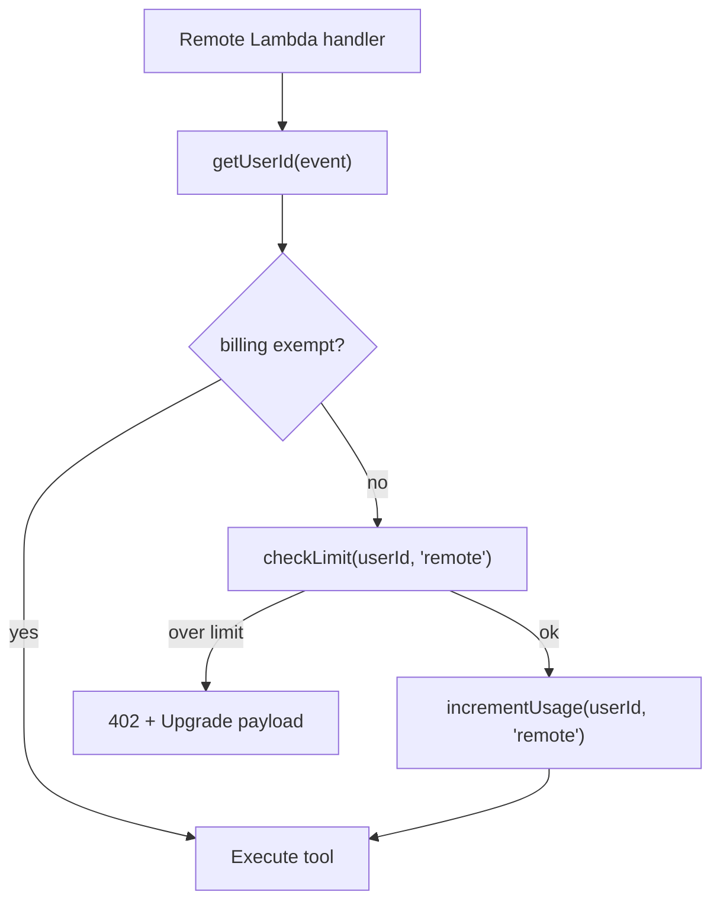
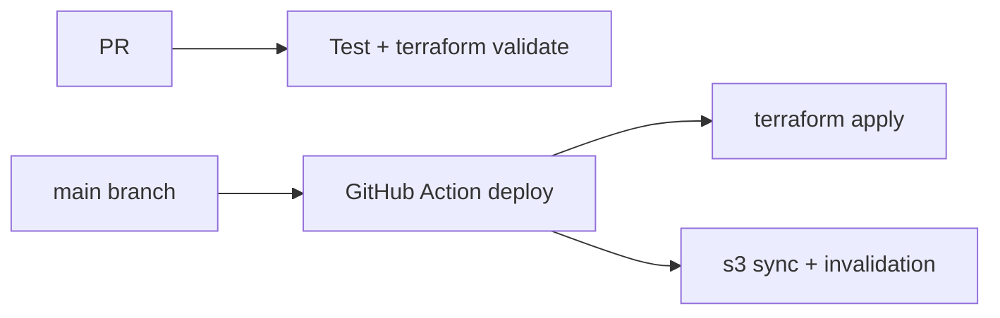
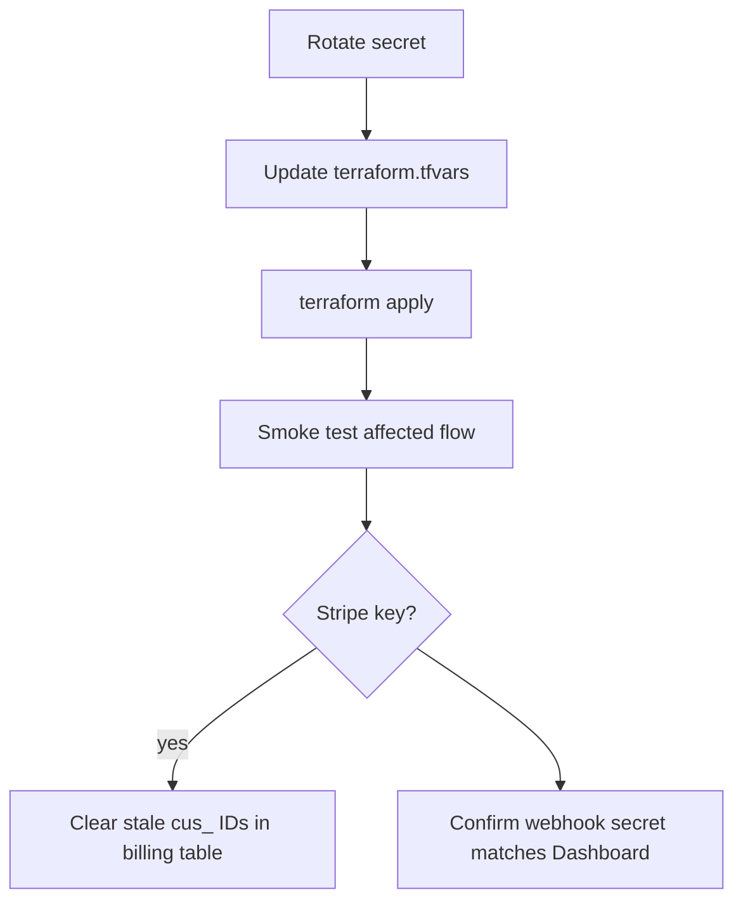
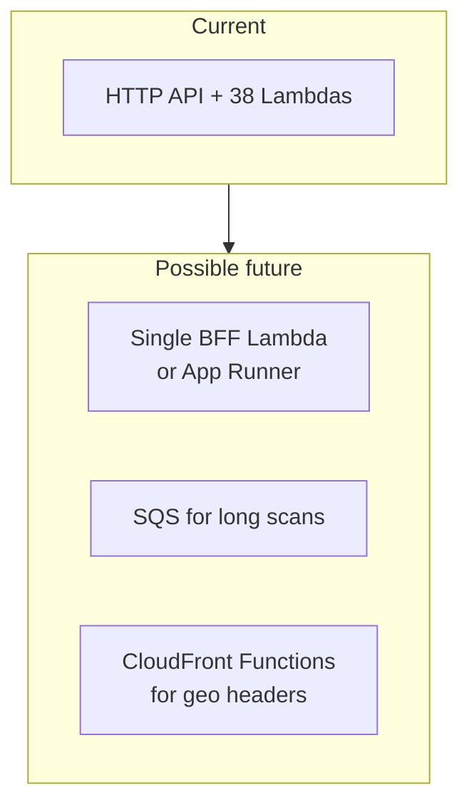

# NetKnife — Recommended Improvements

Prioritized recommendations based on the current codebase and architecture. For task-sized backlog items (quick wins vs large efforts), see [README § Improvements & Roadmap](../README.md#improvements--roadmap). For diagrams see [ARCHITECTURE.md](./ARCHITECTURE.md).

**Legend:** 🔴 Critical · 🟠 High · 🟡 Medium · 🟢 Nice to have

---

## Summary matrix

| Area | Top priority | Effort |
|------|--------------|--------|
| Billing | Server-side usage enforcement | Large |
| Security | Remove WAF cost / real rate limits | Medium |
| Ops | CI deploy + Terraform validate | Medium |
| Product | Terms of service, usage in UI | Small–Medium |
| DX | Shared auth helper, stable Cognito domain | Medium |
| Scale | Avatar → S3, remote Terraform state | Medium |

---

## 1. Server-side billing enforcement 🔴

**Problem:** Pro limits are enforced only in the React app (`BillingContext`, locked sidebar). The `usage` table exists and the billing Lambda reads it, but tool Lambdas do not call `checkLimit()` or `incrementUsage()`. Anyone with a valid JWT can POST directly to `/shodan`, `/security-advisor`, etc.

**Recommendation:**

1. Add a shared module in `backend/shared/netknife-common/` (or a thin billing layer):
   - `checkLimit(userId, meter)` → reads `netknife-{env}-usage` for current month
   - `incrementUsage(userId, meter)` → atomic counter update
2. Call it at the start of every remote Lambda (or via a wrapper middleware).
3. Return `402` with a stable JSON shape; handle in `frontend/src/lib/api.ts` → `UpgradeModal`.
4. Add unit tests for limit math, month rollover, and exempt users.

**Impact:** Closes the main monetization bypass. Required before taking real payments seriously.

---

## 2. WAF and rate limiting 🟠

**Problem:** Terraform creates a WAF Web ACL (~$5/mo base) and log group, but **HTTP APIs cannot use WAF**. README still says “WAF: 1000 req/5min per IP” which is misleading.

**Options (pick one):**

| Approach | Pros | Cons |
|----------|------|------|
| **Remove unused WAF** | Saves cost, honest docs | No AWS-native IP throttle |
| **API Gateway usage plans** | Per-key throttling | Needs API keys or custom authorizer |
| **Lambda-side rate limit** | Works with HTTP API | DynamoDB or ElastiCache counter per IP/sub |
| **Migrate to REST API** | WAF attachable | Larger Terraform change |

**Recommendation:** Remove or stop paying for the unattached WAF ACL; implement **per-user rate limits** in the billing/usage layer (ties to improvement #1) plus a simple **per-IP cap** on unauthenticated routes only (`/billing/webhook` already has Stripe signature).

---

## 3. CI/CD and environments 🟠

**Today:** CI runs lint/build/test on PRs; deploy is manual (`terraform apply`, `s3 sync`, CloudFront invalidation).

**Recommendation:**

1. Add `terraform fmt -check` and `terraform validate` to CI.
2. Optional: `staging` env (`infra/envs/staging/`) with separate Cognito pool and Stripe test account.
3. GitHub Actions deploy on tag or manual `workflow_dispatch` with OIDC to AWS (no long-lived keys in secrets).
4. Store Terraform state in S3 + DynamoDB lock (backend block in `main.tf` is commented out today).

---

## 4. Observability 🟠

**Today:** CloudWatch logs + alarms on Lambda errors and API 5xx. No tracing, no per-tool metrics.

**Recommendation:**

1. **Structured JSON logs** in Lambdas: `{ tool, userId, durationMs, cacheHit, upstreamError }`.
2. **CloudWatch embedded metrics** or a single custom namespace `NetKnife/Tools` for latency and error rate per route.
3. **X-Ray** (optional): enable on API Gateway + Lambdas for slow-request debugging.
4. **Dashboard**: one CloudWatch dashboard with API latency, 5xx rate, Stripe webhook failures, DynamoDB throttles.

---

## 5. Security hardening 🟡

| Item | Current state | Suggestion |
|------|---------------|------------|
| MFA | Off in Cognito | Optional TOTP for admins; encourage for all users |
| Admin lists | `admin_usernames` in tfvars + hardcoded `alex.lux` in frontend | Single source: API returns `isAdmin` from JWT custom claim or profile |
| JWT decode fallback | Some Lambdas decode without verify for local dev | Guard with `NODE_ENV` or remove in production bundles |
| Avatar storage | Base64 in DynamoDB (250KB cap) | S3 presigned upload + CloudFront URL; smaller DDB items |
| Scanners feature | Stub with Secrets Manager IAM ready | Document as disabled until implemented; restrict IAM |
| Secrets rotation | Manual tfvars update | Runbook: Stripe, Cognito, third-party keys (see below) |

### Key rotation runbook (document + automate)

---

## 6. Developer experience 🟡

| Pain point | Fix |
|------------|-----|
| Cognito domain changes every `terraform apply` | Use fixed domain prefix or import existing domain resource |
| `update-env.sh` required after every apply | Bake outputs into CI deploy step; document one command |
| Duplicated `getUserId()` in ~10 Lambdas | Move to `netknife-common` |
| Cache field `value` vs `data` | Standardize on one attribute + shared cache helper |
| Local remote tools need deployed API | Document `VITE_API_URL`; optional SAM/localstack for one Lambda |
| Optional Lambdas missing when API key unset | Consistent `503` + frontend `requiresApiKey` badge on all paid tools |

---

## 7. Product & documentation 🟡

| Item | Why |
|------|-----|
| **`/terms` page** | Expected on Login and Pricing alongside `/privacy` |
| **Usage in Topbar** | “42/500 API calls” builds trust and reduces surprise at limit |
| **90% limit warning** | Banner before hard block |
| **In-app Knowledge Base** | `docs/KNOWLEDGE-BASE.md` exists; route + search not built |
| **Per-Lambda READMEs** | Onboarding for contributors; request/response examples |
| **OpenAPI or `docs/API.md`** | Single reference for all `POST /route` bodies |
| **README accuracy** | Update “admin-only user creation” → self-signup + failsafe; WAF caveat |

---

## 8. Testing 🟡

| Layer | Today | Target |
|-------|-------|--------|
| Frontend unit | ~6 tests (offline math, utils) | Tool parsers, billing context, api 402 handler |
| Backend unit | dns, headers, common | Billing limits, profile validation, board ACL |
| Integration | None | Hit API Gateway with test JWT (Cognito test user) |
| E2E | None | Playwright: login → remote tool → report → PDF |

Start with **billing limit unit tests** — highest ROI given monetization risk.

---

## 9. Cost optimization 🟢

| Item | Notes |
|------|-------|
| Unused WAF ACL | ~$5/mo with no attached resource |
| DynamoDB on-demand | Fine at low traffic; watch hot partitions on `cache` |
| CloudFront | Already efficient for SPA |
| Third-party APIs | Shodan, VirusTotal, OpenAI dominate variable cost — cache aggressively, per-plan quotas |
| Lambda memory | Right-size after profiling (many tools are I/O bound) |
| Avatar in DDB | Large items increase read/write cost; S3 cheaper at scale |

---

## 10. Architecture evolution 🟢

Longer-term options if traffic grows:

1. **BFF pattern:** One router Lambda dispatching to internal handlers — fewer cold starts, shared auth/billing middleware.
2. **SQS + worker** for scanner jobs and heavy OSINT batch queries.
3. **ElastiCache** for hot cache entries if DynamoDB cache costs climb.
4. **Team plan** — `team` exists in billing code but not in Pricing UI; needs org model (shared subscription, seat count).

---

## Suggested implementation order

1. 🔴 Server-side billing enforcement + 402 handling
2. 🟠 Fix WAF story (remove or replace rate limiting)
3. 🟠 Terraform in CI + remote state
4. 🟡 Terms page, usage display, README corrections
5. 🟡 Shared auth/cache helpers + avatar → S3
6. 🟡 Integration tests for billing and auth
7. 🟢 E2E, team plan, knowledge base UI

---

## Related

- [ARCHITECTURE.md](./ARCHITECTURE.md) — system and flow diagrams
- [STRIPE-SETUP.md](./STRIPE-SETUP.md) — payment configuration
- [README § Roadmap](../README.md#improvements--roadmap) — granular B/M/L task list
