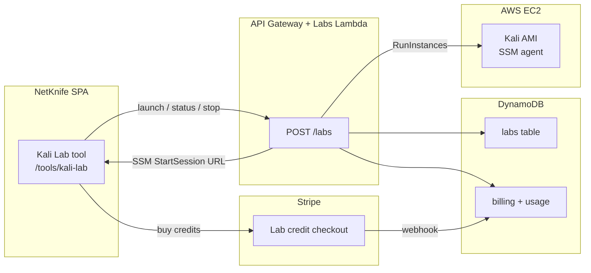

# Kali Labs — One-Click Security VMs

Architecture, billing, Packer AMI standardization, cloud security tool placement, and UI/UX guidance for NetKnife Kali Labs.

**Contents:** [Overview](#overview) · [UX recommendation](#ux-recommendation) · [Billing](#billing) · [Packer AMI](#packer-ami) · [Tool matrix](#tool-matrix) · [Infrastructure](#infrastructure) · [API](#api) · [Deployment](#deployment)

---

## Overview

Kali Labs lets Pro subscribers launch a pre-configured Kali Linux EC2 instance from NetKnife with one click. Instances are:

- Built from a **Packer-standardized AMI** (`packer/kali-netknife/`)
- Accessed via **AWS SSM Session Manager** (no SSH keys, no public inbound ports)
- **Auto-terminated** after session timeout or manual stop
- **Metered by the minute** so you do not lose money on idle VMs



---

## UX recommendation

### Use same-page, tabbed UI (not a new window)

| Approach | Verdict | Why |
|----------|---------|-----|
| **Same page, in-app tabs** | **Recommended** | Keeps NetKnife shell, billing context, and session timer visible. Matches existing tool patterns. |
| New browser window/tab | Avoid for launch | Loses auth context, harder to show cost timer, feels disjointed. |
| Full-page redirect (like Stripe) | Credits only | Use for Stripe checkout when buying lab credits; return to `/tools/kali-lab?credits=1`. |
| Embedded terminal (Phase 2) | Future | `xterm.js` + SSM WebSocket proxy in the **Terminal** tab. |

### Recommended layout (`/tools/kali-lab`)

```
┌─────────────────────────────────────────────────────────┐
│  Kali Lab                                    [Credits: 45m] │
├──────────────┬──────────────────────────────────────────┤
│  Launch      │  Instance: lab-a1b2c3                     │
│  Terminal    │  Status: running · 23m remaining            │
│  Tools       │  [Open SSM Terminal]  [Stop Lab]            │
│  History     │                                             │
└──────────────┴──────────────────────────────────────────┘
```

**Launch tab**
- Instance size selector (small / standard)
- Estimated cost before launch (“~$0.08/hr, 60 min from credits”)
- Big **Launch Kali Lab** button
- Progress: `provisioning → running → stopping → terminated`

**Terminal tab**
- Phase 1: “Open Terminal” opens AWS SSM console deeplink in a **new tab** (only for terminal access)
- Phase 2: embedded `xterm.js` terminal in the same page (full-screen toggle)

**Tools tab**
- Checklist of pre-installed cloud security tools with `netknife-tools` CLI wrappers
- Links to runbooks (e.g. “Scan AWS with Prowler”)

**History tab**
- Past sessions with duration and credits used

### Why not open everything in a new window?

Provisioning, billing, and the session timer belong in the NetKnife shell. Opening a new window for the whole flow breaks the upgrade modal, loses sidebar navigation, and makes it easy for users to forget a running (billable) VM.

---

## Billing

### Cost model (defaults)

| Item | Value |
|------|-------|
| EC2 instance | `t3.medium` (~$0.042/hr on-demand) |
| EBS | 30 GB gp3 (~$0.002/hr) |
| Data transfer | Variable |
| **Retail rate** | **$0.12/hr** (~100% margin on compute) |
| **Billing unit** | Per minute (ceil at 1 min) |

### Credit packs (Stripe one-time checkout)

| Pack | Price | Minutes |
|------|-------|---------|
| Starter | $2 | 120 min (2 hr) |
| Standard | $5 | 360 min (6 hr) |
| Power | $12 | 960 min (16 hr) |

### Rules

1. **Pro subscription required** to launch (same as other remote tools).
2. **Credits reserved at launch** (default session: 60 min). Unused minutes refunded on early stop.
3. **Auto-stop** at credit exhaustion or max session (4 hr hard cap).
4. **No launch** if credits &lt; 15 min.
5. Billing-exempt users (`alex.lux`) get unlimited lab access.

### Stripe setup

Create three one-time Prices in Stripe and set in `terraform.tfvars`:

```hcl
stripe_lab_starter_price_id  = "price_..."
stripe_lab_standard_price_id = "price_..."
stripe_lab_power_price_id    = "price_..."
```

---

## Packer AMI

Standard image: `packer/kali-netknife/`

```bash
cd packer/kali-netknife
packer init .
packer build -var "region=us-west-2" .
```

The build:

1. Starts from official Kali Linux (`kali-linux-2024.x` on AWS Marketplace or `kalilinux/kali-rolling` Docker export — template uses `source_ami_filter` for latest Kali)
2. Runs provisioning scripts to install cloud security tools
3. Installs SSM agent, `netknife-tools` CLI, motd
4. Hardens: no default passwords, SSM-only access, unattended-upgrades

Output AMI ID → set `kali_ami_id` in Terraform.

---

## Tool matrix

Which tools belong on the Kali VM vs. NetKnife cloud workers:

| Tool | On Kali VM | NetKnife cloud worker | Notes |
|------|:----------:|:---------------------:|-------|
| OpenSCAP | ✅ | — | CIS/STIG scans on the VM itself |
| Trivy | ✅ | ✅ | VM: local scans; Cloud: CI/CD integration |
| Prowler | ✅ | — | Needs cloud credentials (user provides via `aws configure`) |
| Scout Suite | ✅ | — | Multi-cloud; heavy; run on demand |
| CloudSplaining | ✅ | — | AWS IAM analysis |
| Steampipe | ✅ | — | SQL over cloud APIs |
| Cartography | ⚠️ | ✅ | Needs Neo4j; better as managed worker |
| Cloud Custodian | ✅ | — | Policy runs from VM with creds |
| Falco | ⚠️ | ✅ | Runtime K8s; needs cluster access |
| Kubescape | ✅ | — | Against user kubeconfig |
| kube-bench | ✅ | — | CIS K8s benchmark |
| kube-hunter | ✅ | — | K8s weakness discovery |
| Checkov | ✅ | ✅ | IaC scan on VM; cloud worker for PR scans |
| Terrascan | ✅ | ✅ | Same as Checkov |
| osquery | ✅ | — | Endpoint visibility on the VM |

On-VM tools are exposed via `/usr/local/bin/netknife-tools <tool> [args]` with a manifest at `/opt/netknife/tools-manifest.json`.

---

## Infrastructure

Terraform module: `infra/modules/labs/`

| Resource | Purpose |
|----------|---------|
| VPC + private subnet + NAT | Outbound internet for package installs; no inbound |
| VPC endpoints | SSM, EC2 messages (avoid NAT for SSM) |
| Security group | Egress only |
| IAM instance profile | SSM + minimal S3 read for tool updates |
| DynamoDB `labs` | Session state per user |
| Lambda `labs` | Launch, status, stop, list, buy-credits |
| EventBridge | Sweeper: terminate expired labs every 5 min |

Wire from `infra/envs/dev/main.tf`:

```hcl
module "labs" {
  source = "../../modules/labs"
  # ...
}
```

---

## API

`POST /labs` (JWT required)

| Action | Description |
|--------|-------------|
| `list` | User's labs (active + recent) |
| `launch` | Start a new lab `{ instanceType?, sessionMinutes? }` |
| `status` | `{ labId }` → state, instanceId, minutesUsed, ssmUrl |
| `stop` | Terminate `{ labId }`, refund unused credits |
| `credits` | Current lab credit balance |
| `buy-credits` | `{ pack: "starter"\|"standard"\|"power" }` → Stripe checkout URL |

---

## Deployment

1. **Build AMI**: `packer build` in `packer/kali-netknife/`
2. **Stripe**: Create lab credit prices; add to `terraform.tfvars`
3. **Terraform**: `terraform apply` with `kali_ami_id` and lab price IDs
4. **Frontend**: Tool appears at `/tools/kali-lab` (Pro + credits required)

See also: [STRIPE-SETUP.md](./STRIPE-SETUP.md), [ARCHITECTURE.md](./ARCHITECTURE.md).
